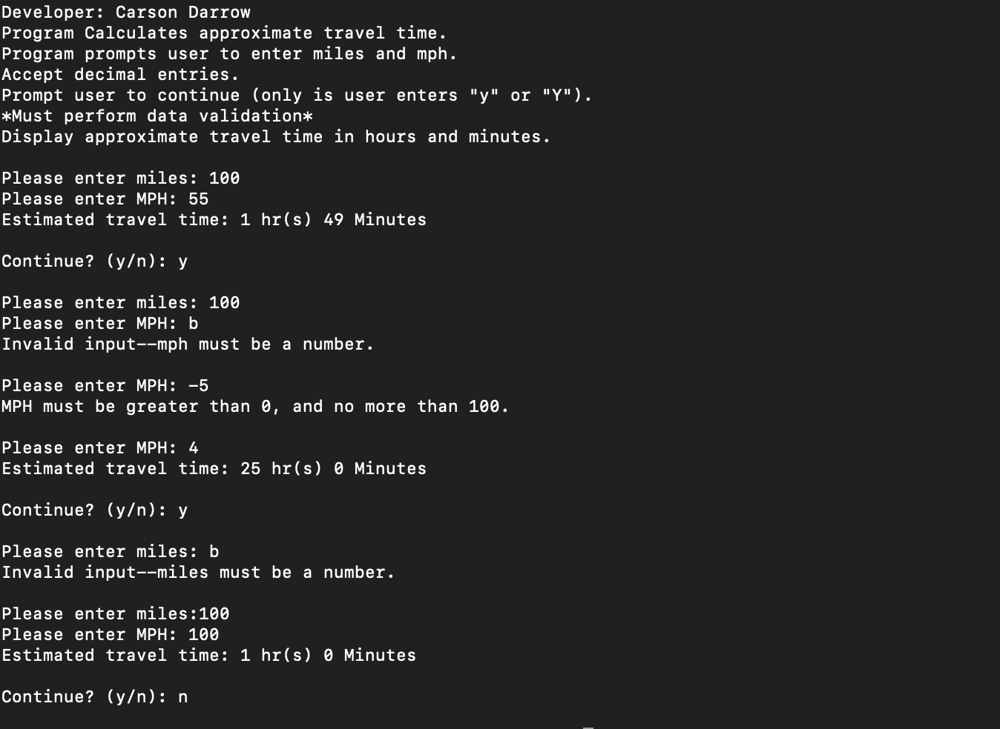
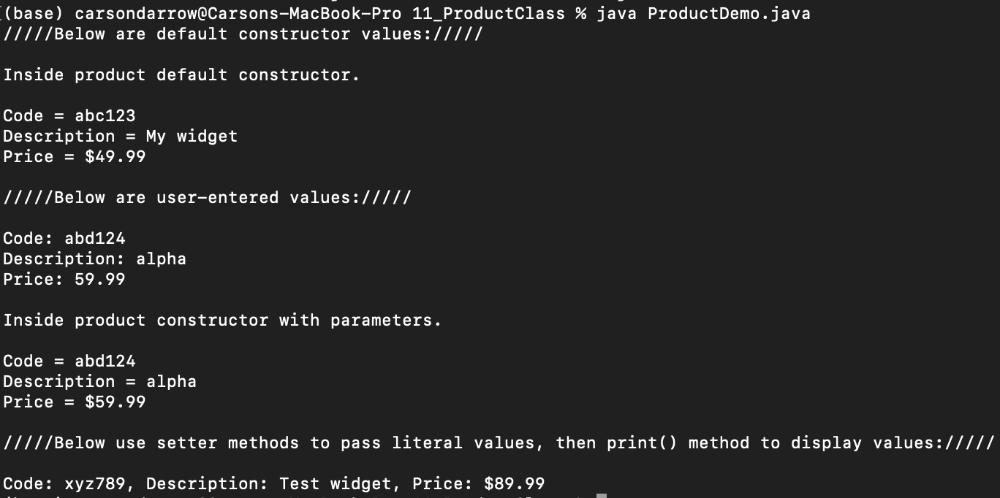

> **NOTE:** This README.md file should be placed at the **root of each of your repos directories.**
>
>Also, this file **must** use Markdown syntax, and provide project documentation as per below--otherwise, points **will** be deducted.
>

# LIS4331

## Carson Darrow

### Assignment 4 Requirements:

Three Parts:

1. Include splash screen image (or, create your own), app title, intro text.
2. Widgets and images must be vertically and horizontally alinged.
3. Must add background color(s) or theme.
4. Create and display launcher iron image.

#### README.md file should include the following items:

* Screenshot of running application's splash screen.
* Screenshot of running application's invalid screen (with appropriate image).
* Screenshots of running application's valid screen (with appropriate image).

> This is a blockquote.
> 
> This is the second paragraph in the blockquote.
>

#### Assignment Screenshots :

| Home Insurance Video | Splash Activity Page |
| -------------- | -------------- |
|  |  |

### Skillset #10 - #12:

| Skillset #10: Travel Time |
| -------------- |
|  |

| Skillset #11: Product Demo |
| -------------- |
 | 

| Skillset #12: Book Demo |
| -------------- |
 |

#### Tutorial Links:

*Bitbucket Tutorial - Station Locations:*
[A1 Bitbucket Station Locations Tutorial Link](https://bitbucket.org/cbd19a/bitbucketstationlocations/ "Bitbucket Station Locations")

*Tutorial: Request to update a teammate's repository:*
[A1 My Team Quotes Tutorial Link](https://bitbucket.org/username/myteamquotes/ "My Team Quotes Tutorial")

