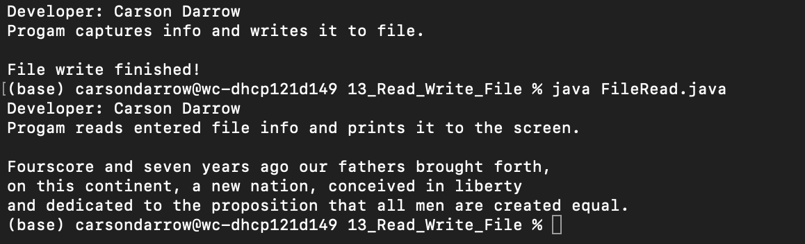
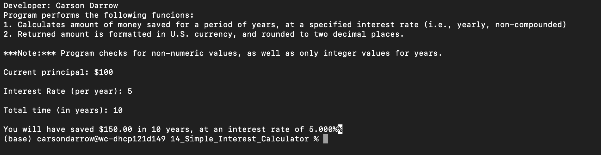
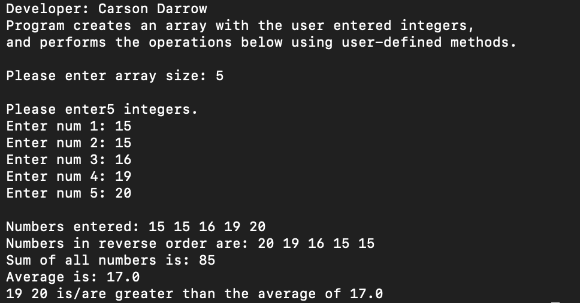

> **NOTE:** This README.md file should be placed at the **root of each of your repos directories.**
>
>Also, this file **must** use Markdown syntax, and provide project documentation as per below--otherwise, points **will** be deducted.
>

# LIS4331

## Carson Darrow

### Assignment 5 Requirements:

Three Parts:

1. 
2. 
3. 
4. 

#### README.md file should include the following items:

* 
* 
* 

> This is a blockquote.
> 
> This is the second paragraph in the blockquote.
>

## Assignment Screenshots :

### Failed Validation Page 1

### Skillset #13 - #15:

| Skillset #13 |
| -------------- |
|  |

| Skillset #14 |
| -------------- |
|  |

| Skillset #15 |
| -------------- |
|  |

#### Tutorial Links:

*Bitbucket Tutorial - Station Locations:*
[A1 Bitbucket Station Locations Tutorial Link](https://bitbucket.org/cbd19a/bitbucketstationlocations/ "Bitbucket Station Locations")

*Tutorial: Request to update a teammate's repository:*
[A1 My Team Quotes Tutorial Link](https://bitbucket.org/username/myteamquotes/ "My Team Quotes Tutorial")

