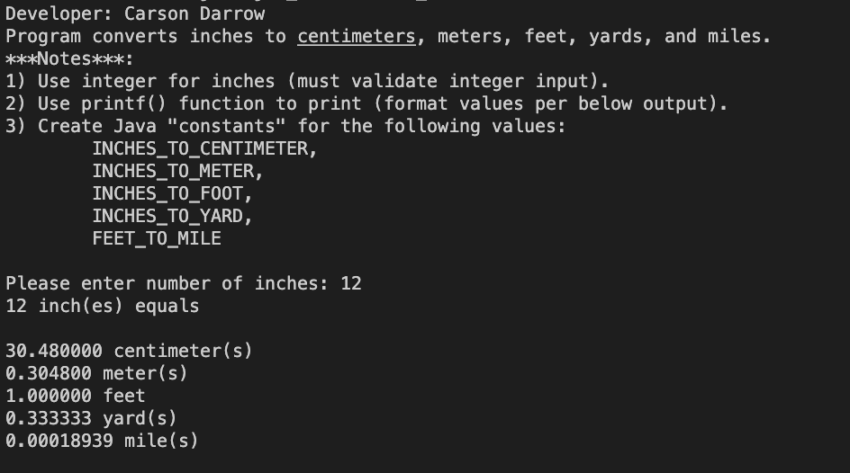
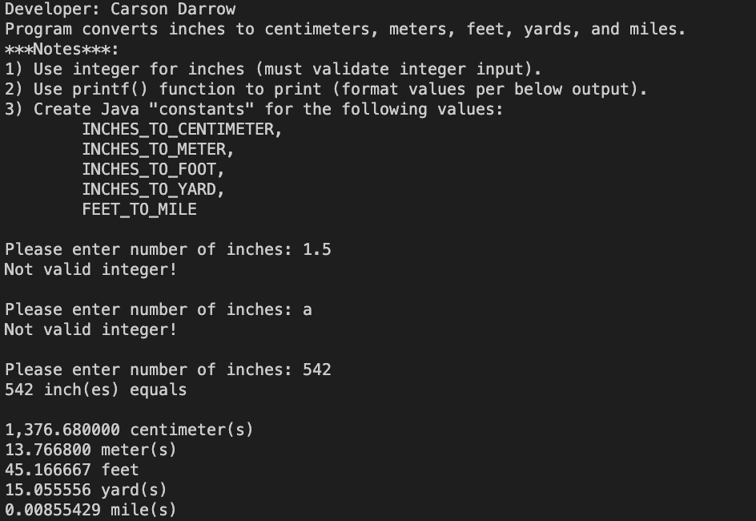
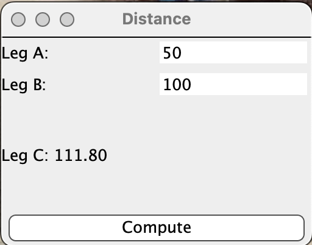
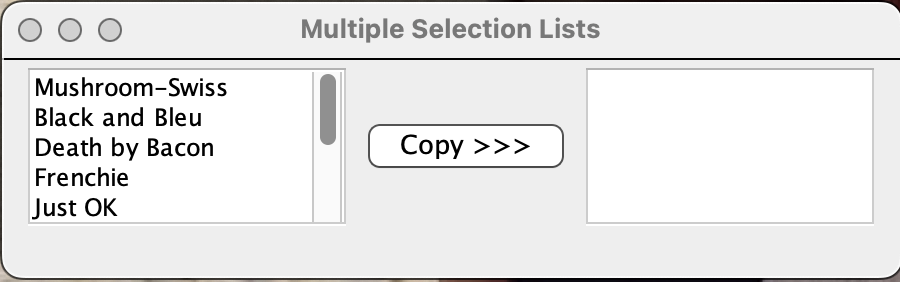
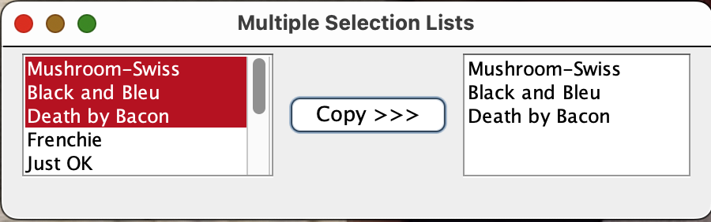
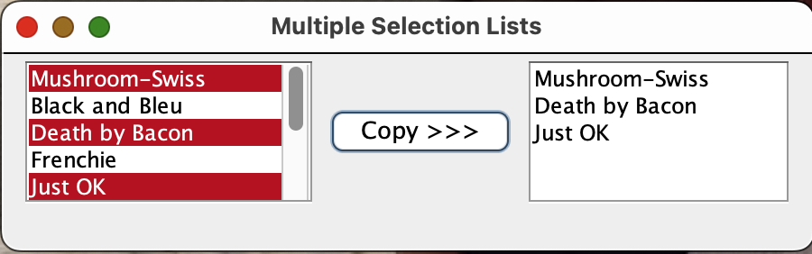

> **NOTE:** This README.md file should be placed at the **root of each of your repos directories.**
>
>Also, this file **must** use Markdown syntax, and provide project documentation as per below--otherwise, points **will** be deducted.
>

# LIS4331

## Carson Darrow 

### Assignment  Requirements:

Three Parts:

1. Create My Music Playlist
2. Splash screen image, app title, intro text.
3. Include artists' images and media.
4. Images and buttons must be vertically and horizontally aligned.
5. Must add background color(s) or theme.
6. Create and display launcher icon image.

#### README.md file should include the following items:

* Course title, Name, Assignment Requirements
* Screenshot of running application’s first user interface
* Screenshot of running application’s second user interface

> This is a blockquote.
> 
> This is the second paragraph in the blockquote.

#### Assignment Screenshots:

**Video of CD's Playlist**:

| **Skillset 7** | **Skillset 7** |
| -------------- | --------------| 
|  | 

**Skillset 8**

 
 
| **Skillset 8** | **Skillset 8** | **Skillset 8** |
| -------------- | --------------| --------------| 
|  |  | 

