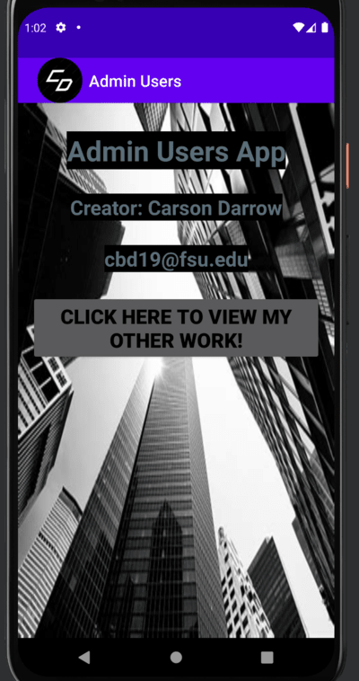
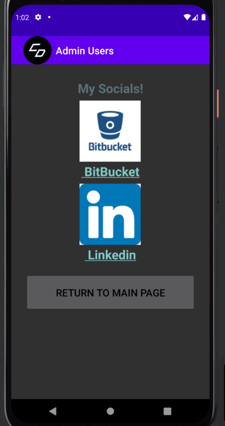
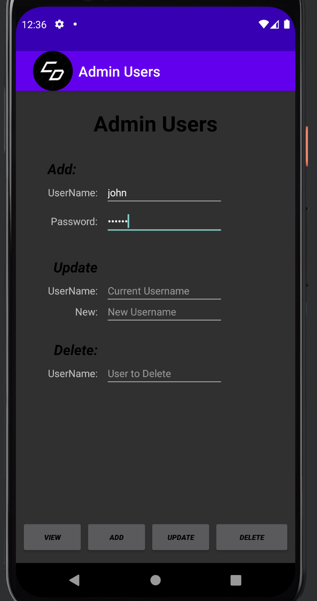
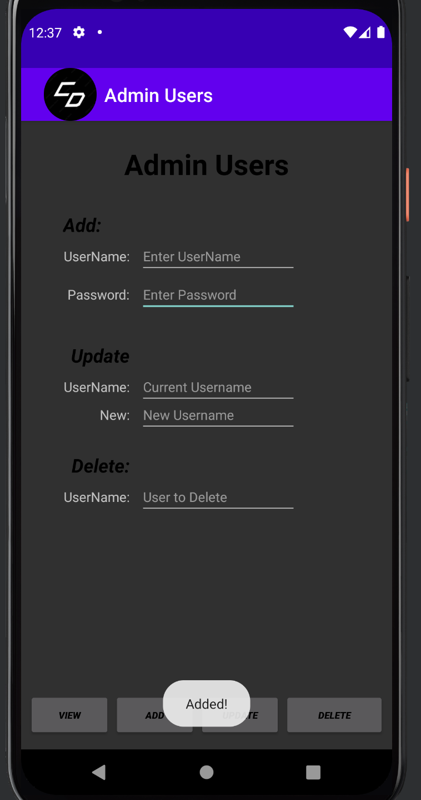
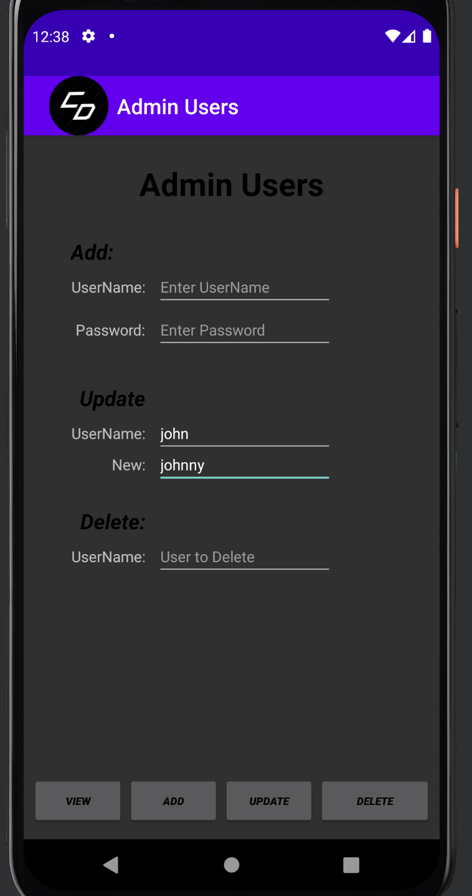
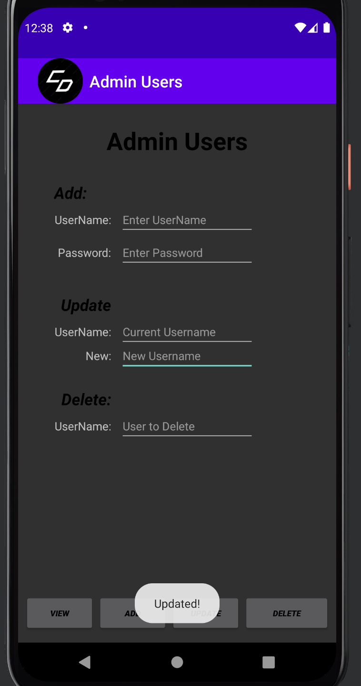
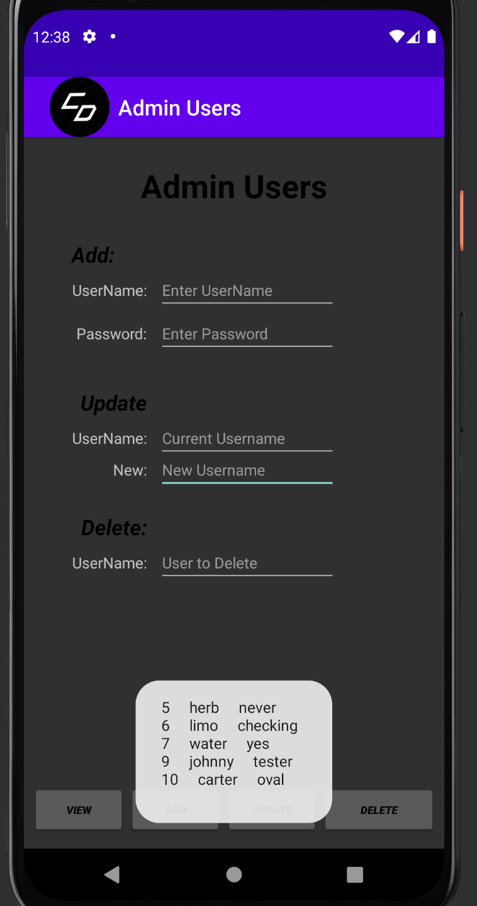
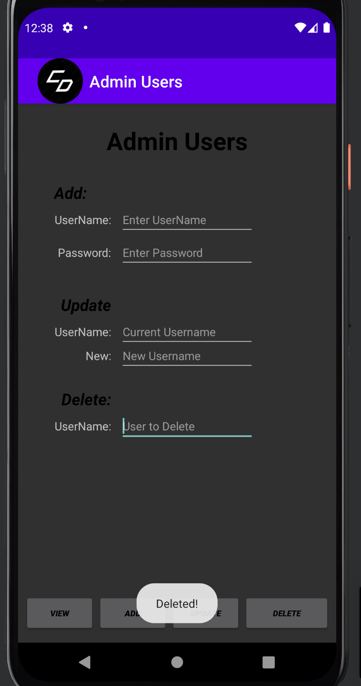
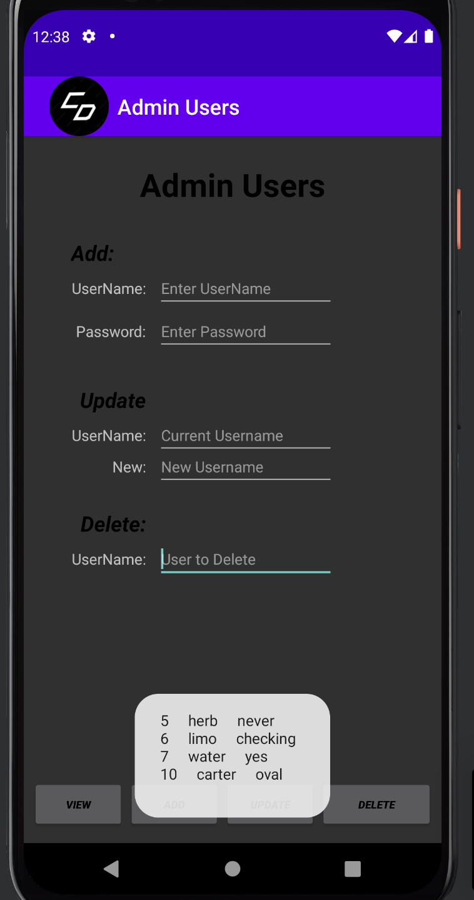

> **NOTE:** This README.md file should be placed at the **root of each of your repos directories.**
>
>Also, this file **must** use Markdown syntax, and provide project documentation as per below--otherwise, points **will** be deducted.
>

# LIS4331

## Carson Darrow

### Project 2 Requirements:

1. Include splash screen 
2. Must use persistent data: SQLite database
3. Insert at least five users
4. Must add background color(s) or theme
6. Create and display launcher icon image

#### README.md file should include the following items:

* Course title, Your name, Assignment Requirements
* At least five screenshots of running application, as per below

> This is a blockquote.
> 
> This is the second paragraph in the blockquote.

#### Assignment Screenshots:

| **Main Splash Screen** | **Work Splash Screen** |
| -------------- | --------------|
|  |  |

| **Add User Input** | **Add User Pop Up** | **Add User View** |
| -------------- | --------------| --------------| 
|  |  | 

| **Update User Input* | **Update User Pop Up** | **Update User View** |
| -------------- | --------------| --------------| 
|  |  | 

| **Delete User Input* | **Delete User Pop Up** | **Delete User View** |
| -------------- | --------------| --------------| 
|  |  | 

### Admin Users Video

#### Tutorial Links:

*Bitbucket Tutorial - Station Locations:*
[A1 Bitbucket Station Locations Tutorial Link](https://bitbucket.org/cbd19a/bitbucketstationlocations/ "Bitbucket Station Locations")

*Tutorial: Request to update a teammate's repository:*
[A1 My Team Quotes Tutorial Link](https://bitbucket.org/username/myteamquotes/ "My Team Quotes Tutorial")

